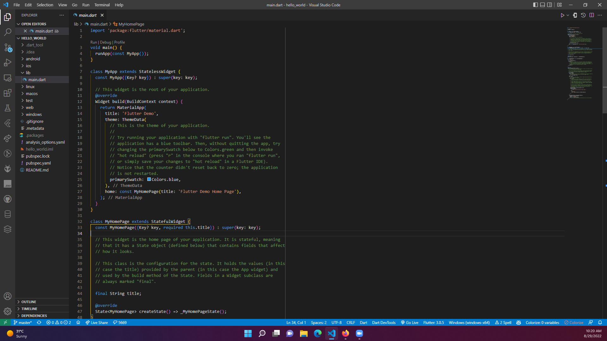
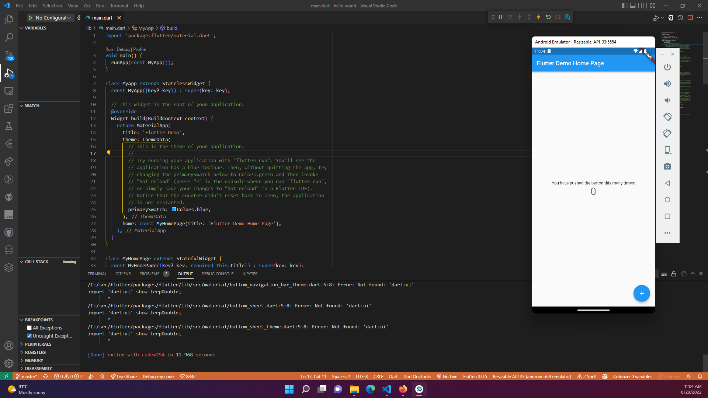
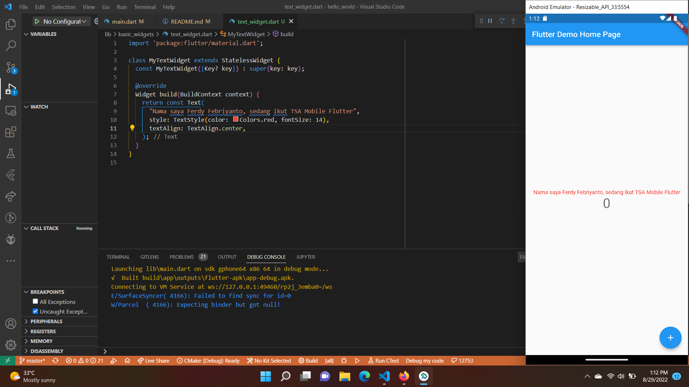
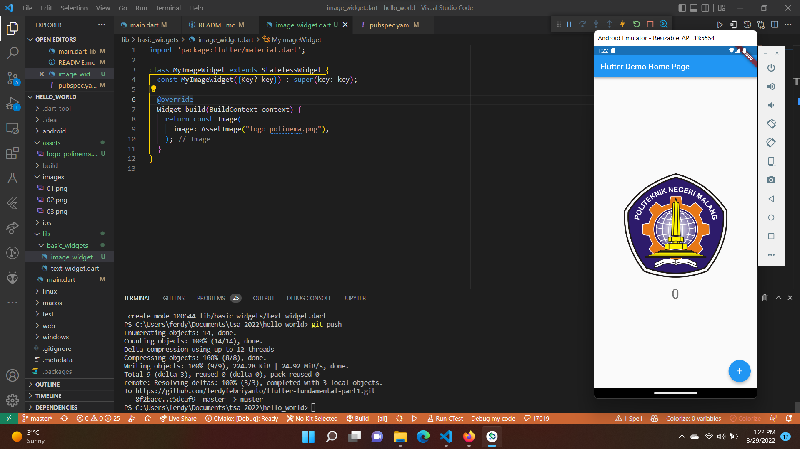
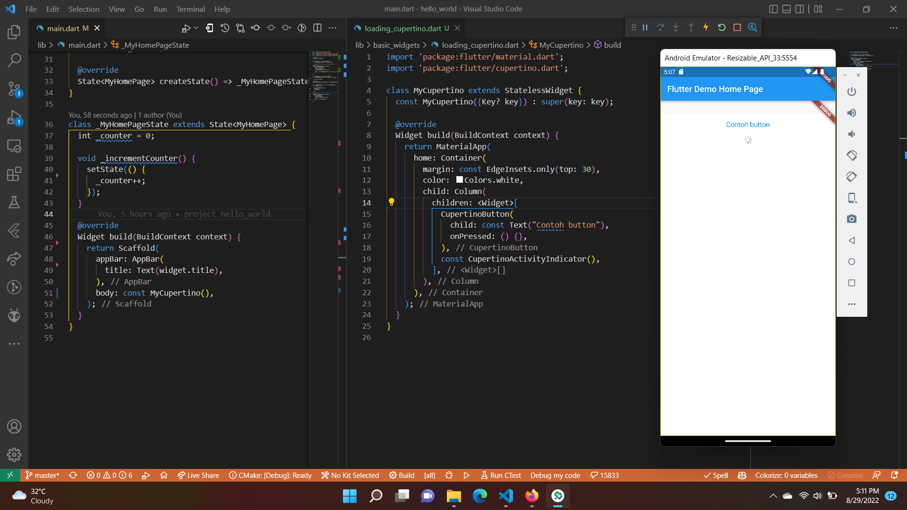

# #16 | Flutter Fundamental - Bagian 1

## Praktikum 1: Membuat Project Flutter Baru

## Praktikum 2: Membuat Repository Github dan Laporan Praktikum

## Praktikum 3: Menerapkan Widget Dasar

Langkah 1: Text Widget

Langkah 2: Image Widget

## Praktikum 4: Menerapkan Widget Material Design dan iOS Cupertino

Langkah 1: Cupertino Button dan Loading Bar

