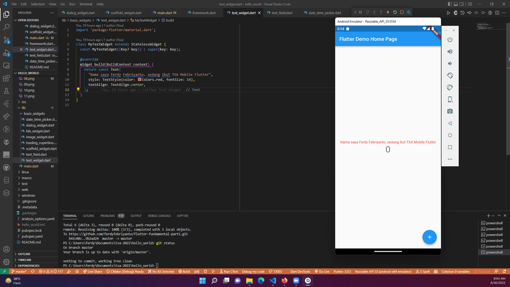
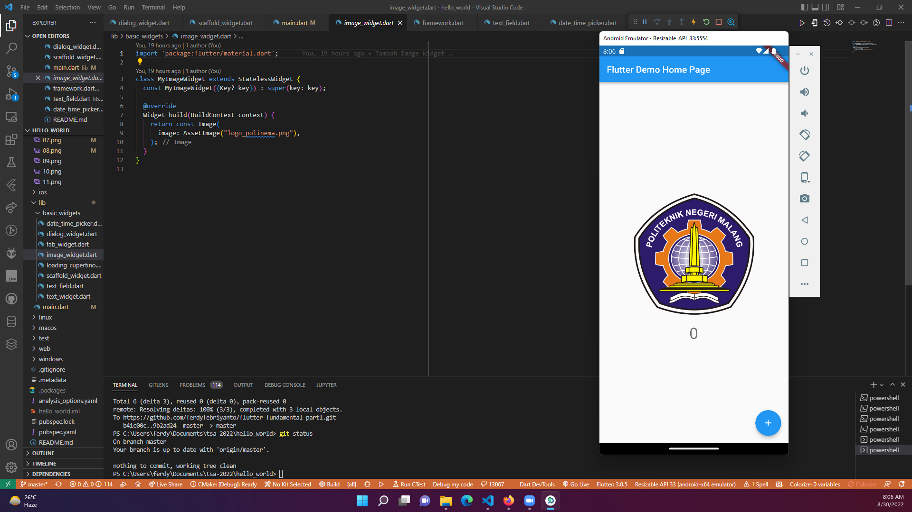
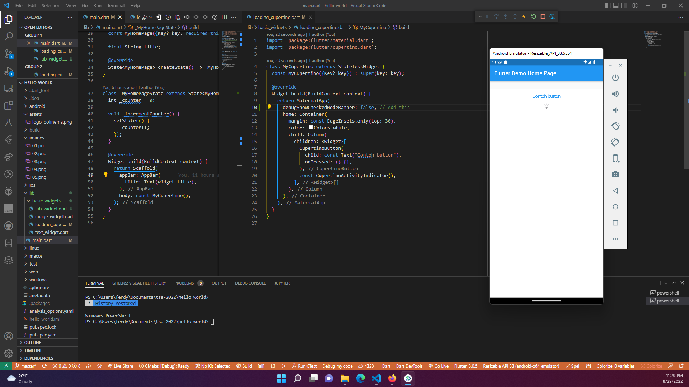
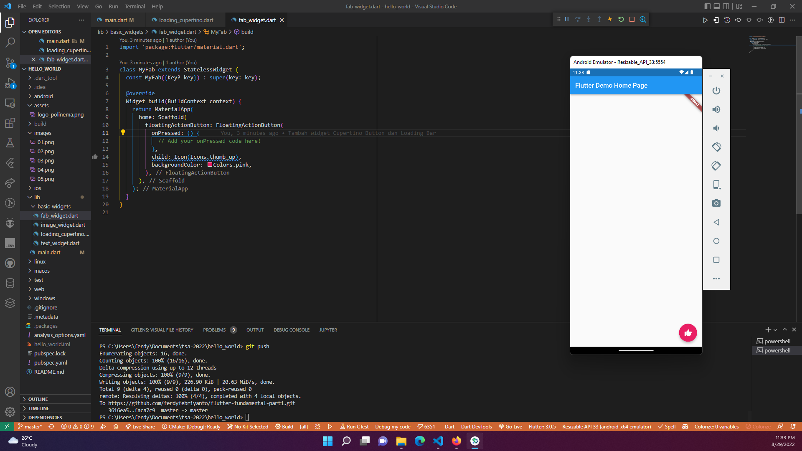
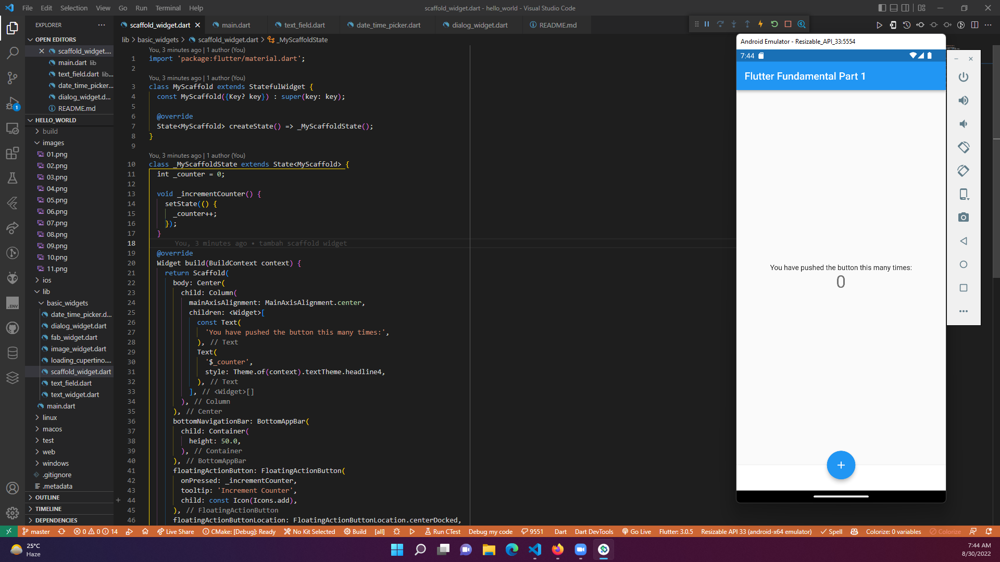
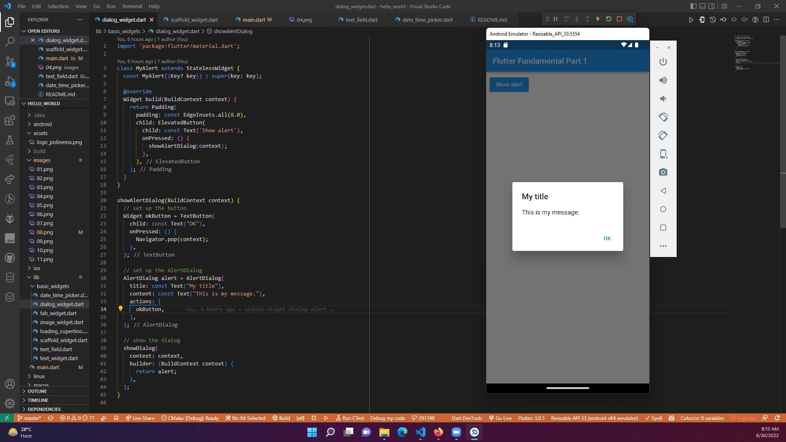
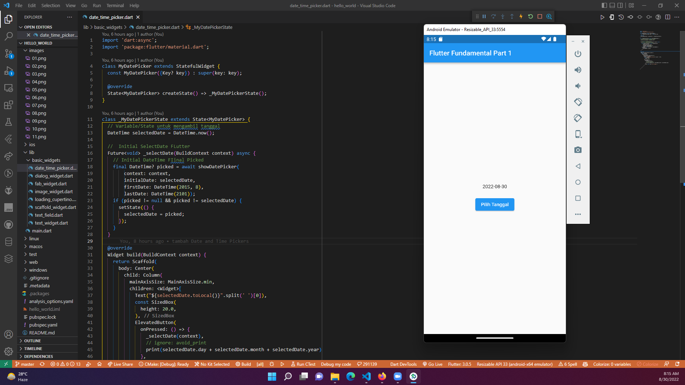

# #16 | Flutter Fundamental - Bagian 1

## Praktikum 1: Membuat Project Flutter Baru

## Praktikum 2: Membuat Repository Github dan Laporan Praktikum

## Praktikum 3: Menerapkan Widget Dasar

Langkah 1: Text Widget

Langkah 2: Image Widget

## Praktikum 4: Menerapkan Widget Material Design dan iOS Cupertino

Langkah 1: Cupertino Button dan Loading Bar

Langkah 2: Floating Action Button (FAB)

* Button widget terdapat beberapa macam pada flutter yaitu ButtonBar, DropdownButton, TextButton, FloatingActionButton, IconButton, OutlineButton, PopupMenuButton, dan ElevatedButton.

Langkah 3: Scaffold Widget

* Scaffold widget digunakan untuk mengatur tata letak sesuai dengan material design.

Langkah 4: Dialog Widget

* Dialog widget pada flutter memiliki dua jenis dialog yaitu AlertDialog dan SimpleDialog.

Langkah 5: Input dan Selection Widget

* Flutter menyediakan widget yang dapat menerima input dari pengguna aplikasi yaitu antara lain Checkbox, Date and Time Pickers, Radio Button, Slider, Switch, TextField.

Langkah 6: Date and Time Pickers

* Date and Time Pickers termasuk pada kategori input dan selection widget.

## TUGAS

* Pada praktikum 4 mulai dari Langkah 3 sampai 6, buatlah file widget tersendiri di folder basic_widgets, kemudian pada file main.dart cukup melakukan import widget sesuai masing-masing langkah tersebut!
